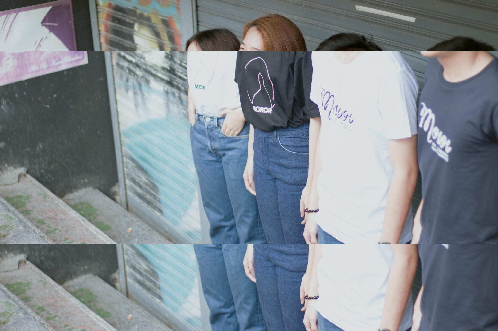

<!DOCTYPE html>
<html>
<title>every day is runway.</title>
<meta charset="UTF-8">
<meta name="viewport" content="width=device-width, initial-scale=1">
<link rel="stylesheet" href="w3.css">
<link rel="stylesheet" href="w4.css">
<link rel="stylesheet" href="w5.css">
<link rel="stylesheet" href="w6.css">

<body class="w3-light-grey">
            

                

                    

                        <a href="#">
			     
                            
                             
			 
                        </a>
                    

                

            

 <!-- Image header -->

  <ul>
    <li><a href="/HOME">HOME</a></li>
    <li><a href="/ABOUT" id="quick_sign_in_button">ABOUT US</a></li>
    <li><a href="/PHOTO">PHOTO</a></li>
  </ul>

</body>
</html>
